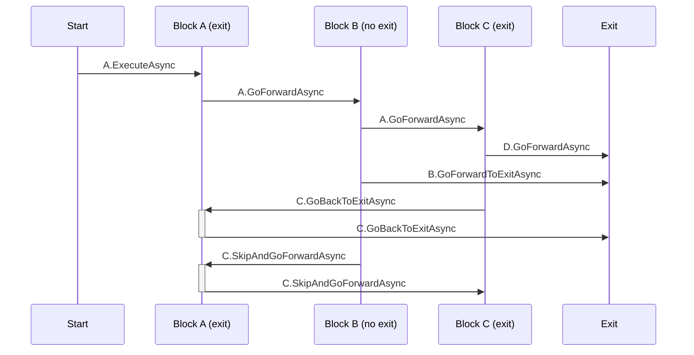

# PipelineBlocks

.NET library allows to...

```mermaid
sequenceDiagram
participant S as Start
participant A as Block A (exit)
participant B as Block B (no exit)
participant C as Block C (exit)
participant E as Exit
S->>A: A.ExecuteAsync
A->>B: A.GoForwardAsync
B->>C: A.GoForwardAsync
C->>E: D.GoForwardAsync
B->>E: B.GoForwardToExitAsync
C->>+A: C.GoBackToExitAsync
A->>-E: C.GoBackToExitAsync
B->>+A: C.SkipAndGoForwardAsync
A->>-C: C.SkipAndGoForwardAsync
```