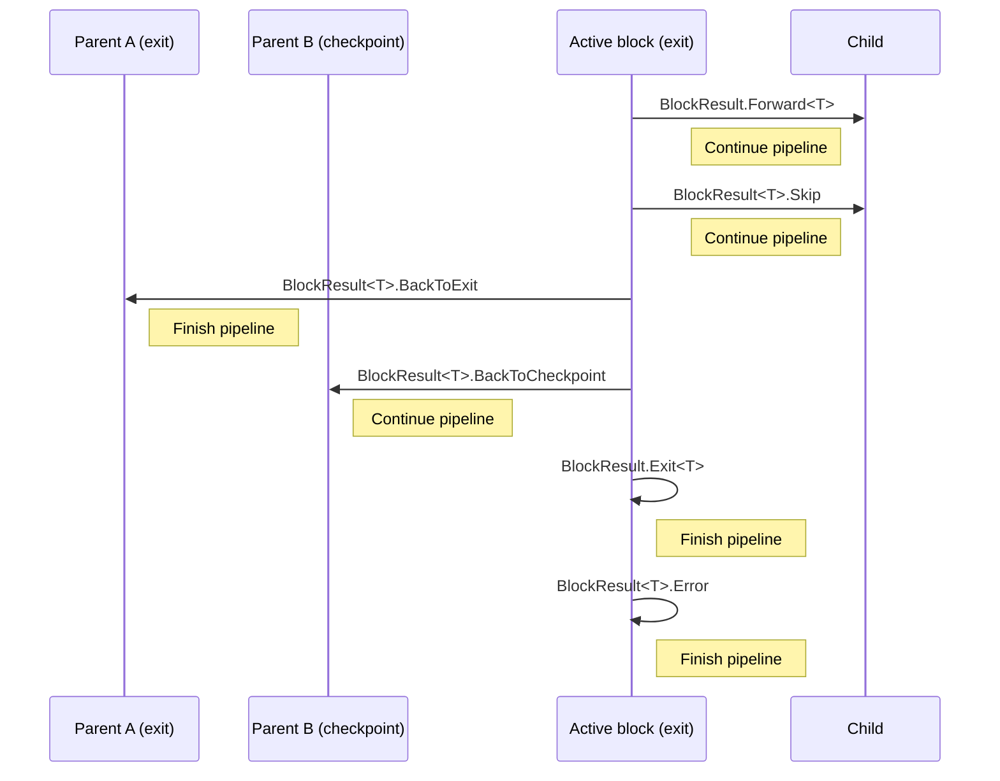

# PipelineBlocks

[](https://www.nuget.org/packages/PipelineBlocks)
[](https://www.nuget.org/packages/PipelineBlocks)
[](https://github.com/danielklecha/PipelineBlocks/blob/master/LICENSE.txt)
[](https://coveralls.io/github/danielklecha/PipelineBlocks?branch=master)

A .NET Standard library that can be used to create two-directional pipeline blocks.

## Strong-named version

[](https://www.nuget.org/packages/PipelineBlocks.StrongName)
[](https://www.nuget.org/packages/PipelineBlocks.StrongName)

## Features

- It's asynchronous.
- Allows moving forward and backward in the pipeline.
- Allows skipping the current block and removing it from the pipeline.
- Blocks can be marked as an exit, meaning the pipeline can be finished at that stage.
- Blocks can be marked as checkpoints, allowing the pipeline to revert to this stage from any descendant block.
- Child blocks can be dynamically determined based on the data of the current block.
- Blocks can be merged into modules for better organization and reuse.
- The library includes unit tests.

## Available actions in active block



## Example - single blocks

```csharp
using PipelineBlocks.Extensions;
using PipelineBlocks.Models;

var block2 = new PipelineBlock<string>()
{
    Job = (x, c) => Task.FromResult(BlockResult.Forward("success")),
    KeyCondition = x => "block2",
    NameCondition = x => "block2",
    CheckpointCondition = x => false,
    ExitCondition = x => true,
    ChildCondition = x => null
};
var block1 = new PipelineBlock<int>()
{
    Job = (x, c) => Task.FromResult(BlockResult.Forward(123)),
    KeyCondition = x => "block1",
    NameCondition = x => "block1",
    CheckpointCondition = x => false,
    ExitCondition = x => true,
    ChildCondition = x => block2
};
await block1.ExecuteAsync();
```

## Example - module

```csharp
using PipelineBlocks.Extensions;
using PipelineBlocks.Models;

var endBlock = new PipelineBlock<int>()
{
    Job = (x, c) => Task.FromResult(BlockResult.Forward(123)),
    KeyCondition = x => "block1",
    NameCondition = x => "block1",
    CheckpointCondition = x => false,
    ExitCondition = x => true
};
var startblock = new PipelineBlock<int>()
{
    Job = (x, c) => Task.FromResult(BlockResult.Forward(123)),
    KeyCondition = x => "block1",
    NameCondition = x => "block1",
    CheckpointCondition = x => false,
    ExitCondition = x => true,
    ChildCondition = x => endBlock
};
var module = new PipelineModule<int>(startblock, endBlock);
await module.ExecuteAsync();
```

## License

`PipelineBlocks` is provided as-is under the MIT license.
