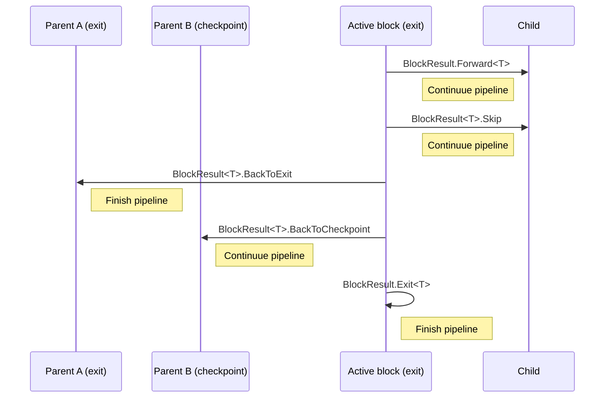

# PipelineBlocks

[](https://www.nuget.org/packages/PipelineBlocks)
[](https://www.nuget.org/packages/PipelineBlocks)
[](https://github.com/danielklecha/PipelineBlocks/blob/master/LICENSE.txt)
[](https://coveralls.io/github/danielklecha/PipelineBlocks?branch=master)

A .NET Standard library that can be used to create two-directional pipeline blocks.

## Example

```csharp
using PipelineBlocks.Extensions;
using PipelineBlocks.Models;

var block2 = new PipelineBlock<string>()
{
    Job = (x, c) => BlockResult.Forward("success"),
    KeyCondition = x => "block2",
    NameCondition = x => "block2",
    CheckpointCondition = x => false,
    ExitCondition = x => true,
    ChildCondition = x => null
};
var block1 = new PipelineBlock<int>()
{
    Job = (x, c) => BlockResult.Forward(123),
    KeyCondition = x => "block1",
    NameCondition = x => "block1",
    CheckpointCondition = x => false,
    ExitCondition = x => true,
    ChildCondition = x => block2
};
await block1.ExecuteAsync();
```

## Available actions in active block


